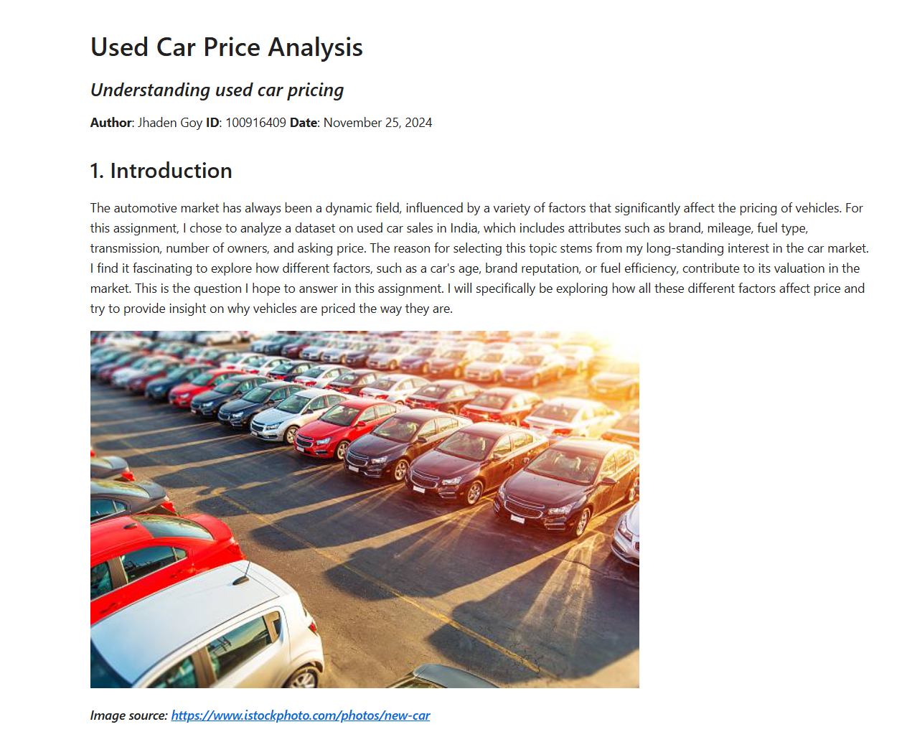
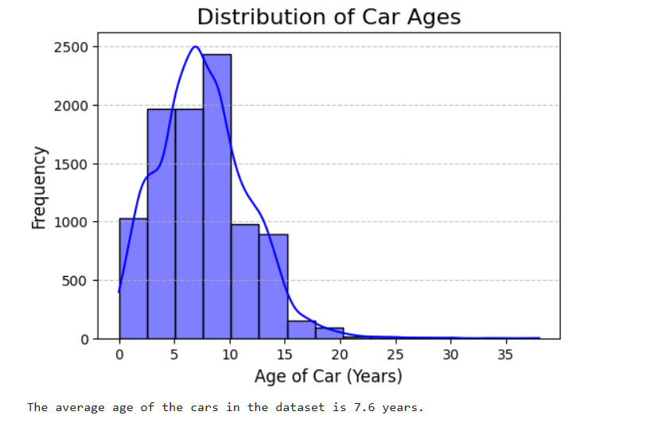
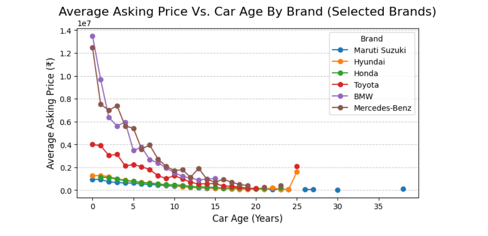

# Used-Car-Market-Analysis
Jupyter Notebook that analyzes India's used car market providing various insights. 

 

## Project Goals

* Understand the overall structure of the Indian used-car market in the dataset

* Identify which features (e.g., year, kilometers driven, fuel type, transmission, brand/model) most influence price

* Detect outliers and data quality issues that affect analysis

* Produce visual insights that can inform buyers/sellers and future predictive modeling

## Key Questions Explored

* How does price vary by brand and model?
* What is the relationship between kilometers driven and price?

* How do fuel type and transmission affect resale price?

* Do newer model years show significantly higher resale value?

* Which segments show the best “value” (price vs. age vs. usage)?

* Are there extreme outliers (unrealistic year/km/price) that should be removed?

## Screenshots

 
  

## Tech Stack

* Python
* Jupyter Notebook
* Libraries: pandas, numpy, matplotlib, seaborn

